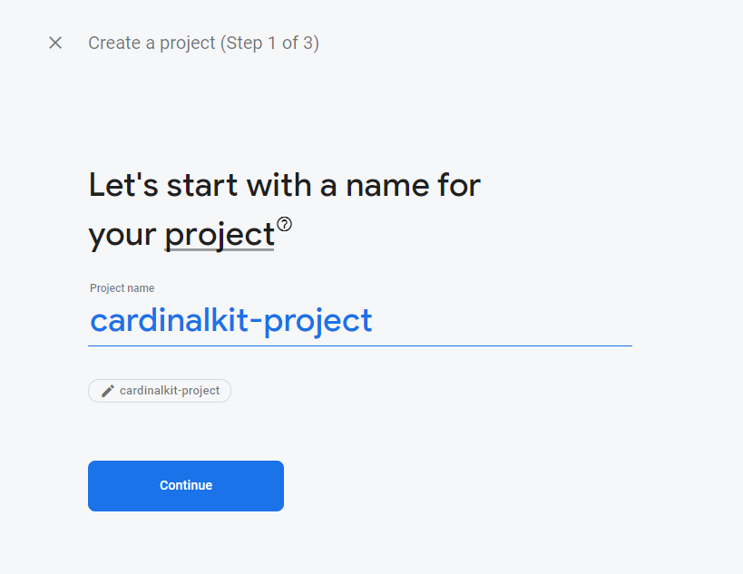
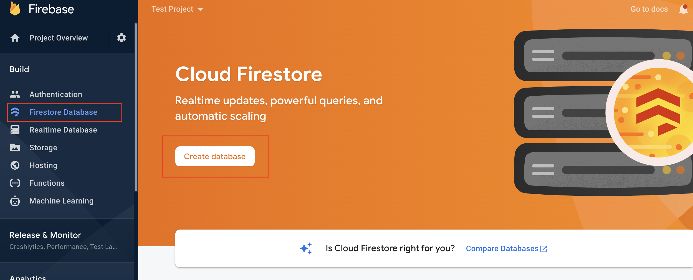
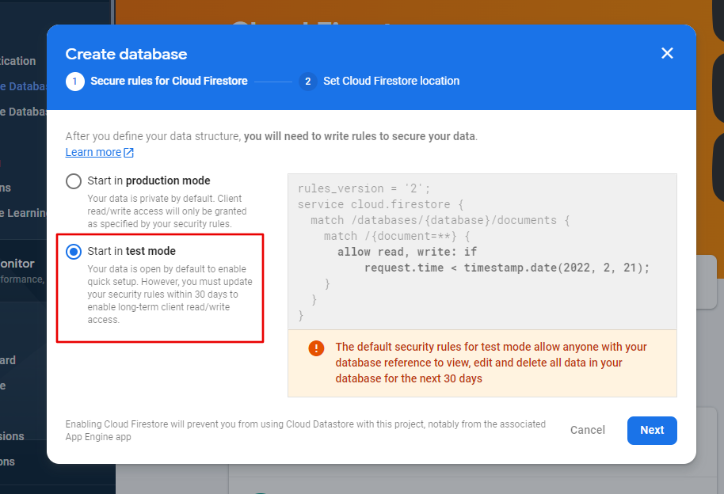
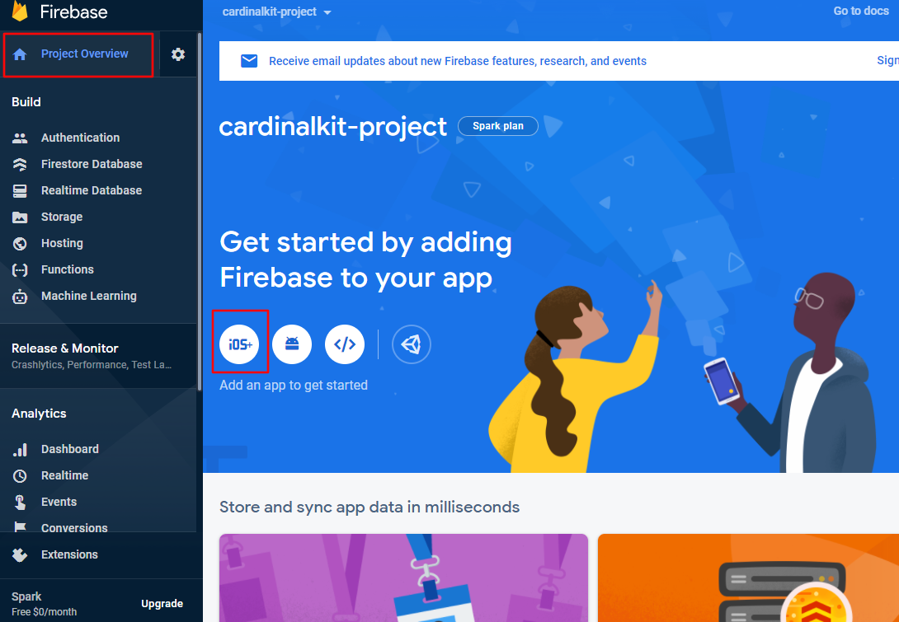
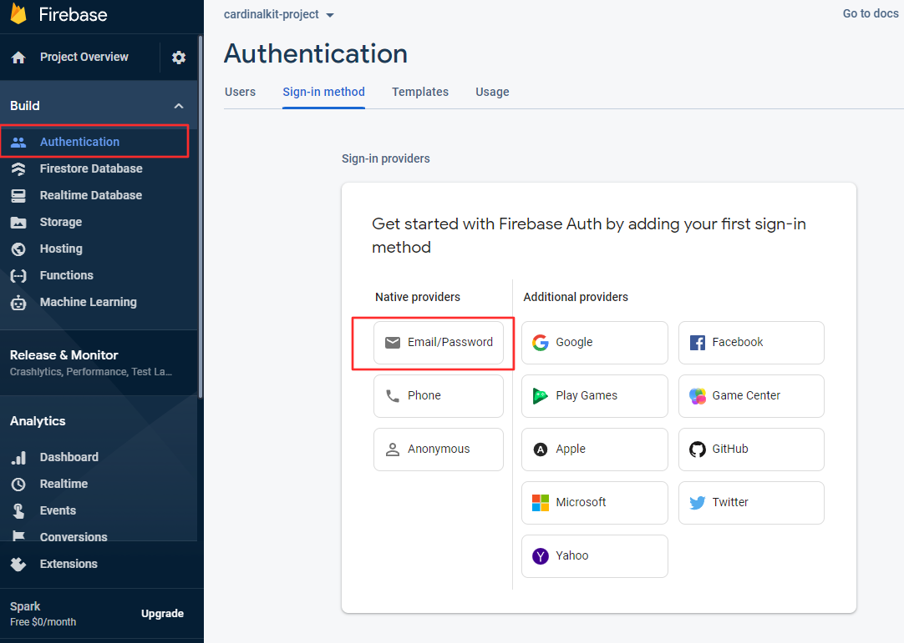
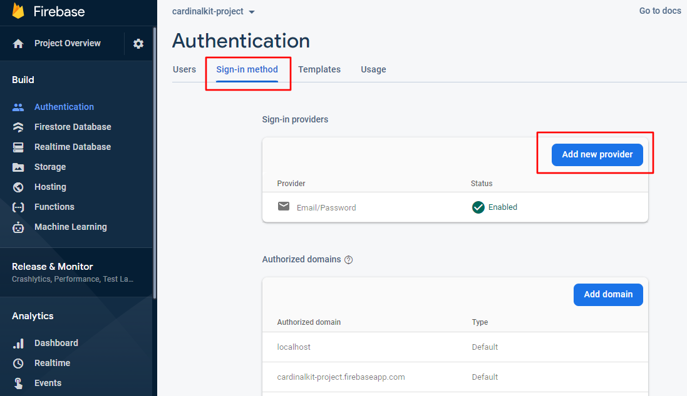

# Set Up Application Infrastructure

<br />

Prior to CardinalKit, researchers would need to implement a backend solution of their choosing so data that their subjects were gathering could be securely stored. CardinalKit leverages existing database architecture on the Google Cloud platform to make it as frictionless as possible to get started with collecting information on your users.

<br />

## 1. Create a Firebase Account

Head on over to <a href="https://firebase.google.com">firebase.google.com</a> and set up an account.
Note: you may need to use your personal email instead of your university assigned one.

Once, your account is created, log into your Firebase console (top right) and add a new project. Name the project to be something related to your app for future reference.

<Example>

</Example>

<br />
It is important that you disable Google Analytics because it is not BAA compliant and then click "Create". It will take around a minute to set up.
<br />

<Example>

</Example>

<br />
When your project is ready, click "Continue". 
<br />

<Example>

</Example>

Now you will be returned to the console. Click "Firestore Database" under the "Build" section in the sidebar, and then "Create database".
<br />
<br />

<Example>

</Example>

<br />
<br />

Be sure to start the database in test mode so your research IT can configure the rules for the storage.

</br>

::: warning
When developing and testing your application, it is fine to use your own custom Firebase backend. However, in production, it is easier to hand-off database maintenance to your IT department (e.g. Stanford Medicine IT). Their configuration will be guaranteed to be HIPAA compliant.
:::

<Example>

</Example>

<br />
<br />

Finally, set the deploy location to "us-central" or any location close to your study and click "Enable".

<br />

<Example>

</Example>

## 3. Link App to Firebase Project

The last step is to configure your CardinalKit app to communicate with your newly created Firebase database. In the sidebar, select "Project Overview" and then "iOS".

<br />

<Example>

</Example>

<br />
<br />


Fill out the registration form using the bundle ID you selected on while creating your CardinalKit project in Xcode from Step 4 of the previous section. You do not need to answer the other questions.

<br />
<br />

<Example>

</Example>

<br />
<br />

Download the "GoogleService-Info.plist" file when prompted. There will be a "GoogleService-Info.plist" in the Xcode project as well located in "CardinalKit-Example" > "CardinalKit" > "Supporting Files". Replace this one with the new file you just downloaded. Run the app again and make sure no errors pop up.

<Example>

</Example>

<br />
You don't need to continue through the rest of the steps and set up the Firebase SDK and initialization code in your app. This is already done for you in CardinalKit. Go through to step 5 and click on "Continue to Console".
<br />

## 4. Enabling Authentication

CardinalKit supports both **Email/Password Authentication** and **Sign In With Apple**.

### Setting up Email/Password Authentication

In your Firebase project, click on Authentication. Then click on "Email/Password". 

::: tip
If you have already set up an authentication method and are adding another one, you will see a different screen at this step. In that case, click on "Sign-In Method" at the top and click "Add New Provider", instead.
:::

<Example>

</Example>

<br />

On the next screen, enable "Email/Password Sign On" and click "Save".

<Example>

</Example>

<br />

You should now see that Email/Password authentication has been enabled.

### Setting up Sign in with Apple (Optional)

Read the entire "Before You Begin" section of the Authenticate Using Apple on iOS Firebase tutorial and make sure you have the correct configurations for this feature.

In your Firebase project, navigate to "Authentication" > "Sign-in method" and click on "Add Provider".

<Example>

</Example>

<br />

Now select "Apple".

<Example>

</Example>

<br />

Set Apple to "Enabled".

<Example>

</Example>

<br />

The last step is to open the CKConfiguration.plist file in Xcode and edit the **Enabled** key under the **Sign in with Apple** key to **1**.

## 5. Add Custom Rules to the Firebase Database

The final step is to allow authorized users to upload data to Firebase.

<br />
 
Navigate to the Database tab in your Firebase dashboard. Find the "Rules" section and edit the text to match the following rule set:

<Example>

```
rules_version = '2';
service cloud.firestore {
  match /databases/{database}/documents/studies/{studyId}/users {
    match /{userId}/{document=**} {
      allow read, write: if request.auth.uid != null;
    }
  }
}
```
</Example>

Congrats! You're now set up to use CardinalKit as a starting point for your research app - run the app within Xcode and test it out!

<br />

<br />

