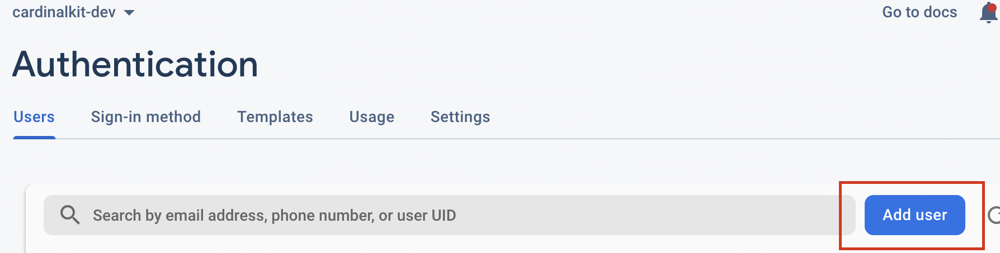
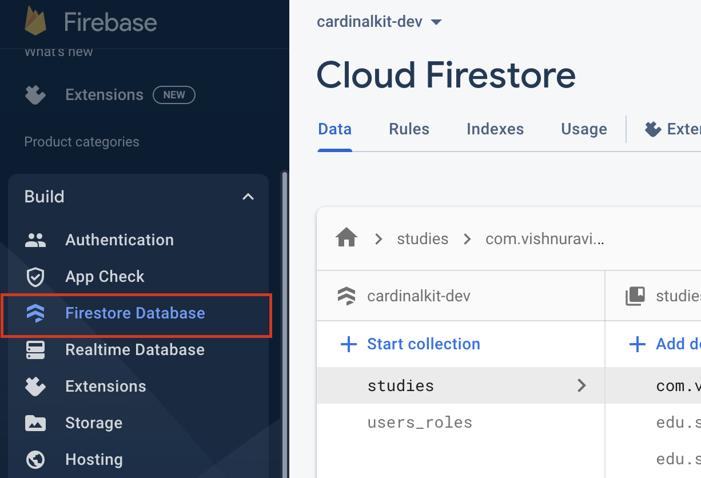

# Setting Up the Web Dashboard

CardinalKit offers a web dashboard that can be used to visualize mobile health data and survey responses, as well as create and schedule surveys.

### Requirements

Before getting started, you will need to have configured a Firebase project and connected your CardinalKit iOS or Android app to it. Please refer to the *Set up Application Infrastructure* section in either the iOS or Android section of this guide if you haven't done this yet, then return to this section to continue setting up the dashboard.

You will need to have Node.js installed on your system. To check if Node.js is installed, open a terminal window and type 'node -v'. If it is installed, the version will be displayed. If not, please visit [nodejs.org](https://nodejs.org) to download and install it. 

You will also need to have the Firebase Command Line Interface (CLI) installed on your system. Installation instructions can be found at [firebase.google.com/docs/cli](https://firebase.google.com/docs/cli). 

Once you have both of these tools installed, you can proceed to the first step below.

## 1. Configure Your Firebase Project

Before starting this section, 
 
 Go to [firebase.google.com](https://firebase.google.com) and sign in with the same account that you set up for the mobile app.
 
 Select the same Firebase project that you created previously.
 <br />
 <br />
 
 <br />
 <br />
 Then select **Project Settings** in the configuration menu.
 <br />
 <br />
 
 <br />
 <br />
 Now select **Add app** to create a new web application and associate it with Firebase.
 <br />
 <br />
 
 <br />
 <br />
 Click on the **web app** symbol.

 <br />
 <br />
 
 <br />
 <br />

Give your dashboard application a name and then click "Register App" to continue.

 <br />
 <br />
 
 <br />
 <br />

Copy and save the generated Firebase configuration details.

 <br />
 
 <br />
 <br />

 Using a text editor, open the ***cardinal-kit-web/.env*** file and replace the bolded keys with their values from the configuration you obtained in the last step.

 ```
 VUE_APP_FIREBASE_API_KEY = "**apiKey**"
 VUE_APP_FIREBASE_AUTH_DOMAIN  = "**authDomain**"
 VUE_APP_FIREBASE_PROJECT_ID  = "**projectId**"
 VUE_APP_FIREBASE_STORAGE_BUCKET  = "**storageBucket**"
 VUE_APP_FIREBASE_MESSAGING_SENDER_ID  = "**messagingSenderId**"
 VUE_APP_FIREBASE_APP_ID = "**firebaseConfig.appId**"
 ```

## 2. Create an Administrator account

 <br />

 To manage your dashboard you need to create an Administrator account. This is created from the Firebase console.

 From the [Firebase console](https://console.firebase.google.com), click on **Build** on the left sidebar, and then enter the **Authentication** section.

 <br />
 
 <br />
 <br />

 And then add a new user.
 
 <br />
 

 <br />
 <br />

Enter a username and password for the administrator user.

<br />


<br />
<br />

Now you need to indicate to the dashboard that this new user is an **administrator** user. 

User roles are managed in Firestore Database. For users created from the web, this process will be automatic, it is necessary to do it by hand only once for the administrator user.

First copy the **UID** of the user you just created. You can do this by hovering over the UID and clicking on the Copy icon. 

<br />


<br />
<br />

Then click on **Firestore Database**:

<br />



<br />
<br />

Click *Start collection* and name the collection **users_roles**.

<br />


<br />
<br />

Now, within the newly created collection, click *Add document* and paste in the **UID** of the admin user as the name. Then add a field to the document called **rol** with value **superAdmin**.

<br />


<br />
<br />

The end result should appear as follows:


## 3. Update Firebase Security Rules

In order for your administrator user to be able to access the dashboard, you need to update the **Firebase Security Rules**. This is done from the Firebase console. 

Open **Firestore Database** in the Firebase console, and click on the **Rules** tab. Then replace the rules with the following:

```
rules_version = '2';
service cloud.firestore {
	match /databases/{database}/documents{
  	match /studies/{studyId}{
    	allow write: if request.auth!= null
        allow read: if request.auth!= null
   		
        function accessToStudy() {
   			let data = get(/databases/$(database)/documents/users_roles/$(request.auth.uid)).data;
   			return "studies" in data && studyId in data.studies;
   		}
        
        match /users/{userId}/{path_=**}{
        	allow write: if request.auth!= null && request.auth.uid == userId
        	
            function accessToUser(){
                let data = get(/databases/$(database)/documents/users_roles/$(request.auth.uid)).data;
                return "users_access" in data && userId in data.users_access
        	}

          allow read: if request.auth!= null && 
          (
            request.auth.uid == userId ||
            (
              exists(/databases/$(database)/documents/users_roles/$(request.auth.uid)) &&
              (
                get(/databases/$(database)/documents/users_roles/$(request.auth.uid)).data.rol == "superAdmin" ||
                (
                  get(/databases/$(database)/documents/users_roles/$(request.auth.uid)).data.rol == "doctor" &&
                  (
                    accessToStudy() ||
                    accessToUser()
                  )
                )
              )
            )
          )
        }
        match /surveys/{surveyId}/{path_=**}{
        	allow write: if request.auth.uid != null 
        	allow read: if request.auth.uid != null
        }
        
      }
      match /users_roles/{user}/{path_=**}{
      	allow write: if request.auth.uid != null &&
        	(request.auth.uid == user || 
          	exists(/databases/$(database)/documents/users_roles/$(request.auth.uid)) &&
          	get(/databases/$(database)/documents/users_roles/$(request.auth.uid)).data.rol == "superAdmin")
        allow read: if request.auth.uid != null
      }
	}
}
```

Click **Publish** to save your new rules.

## 4. Create Indexes

Cloud Firestore requires [indexes](https://firebase.google.com/docs/firestore/query-data/indexing) to be created for each query. In this section, we will create custom indexes that our dashboard will use.

Navigate to **Firestore Database**, then click the **Indexes** tab. Make sure **Composite** is selected.

 <br />
 <br />
 
 <br />
 <br />

 Please add the six indexes that are shown in the image above by clicking **Add Index**. It may take a couple of minutes for the indexes to finish building.

## 5. Test the Dashboard Locally

Now you can test the dashboard locally.

```bash
 cd cardinal-kit-web
```

Once in the folder, the first thing is to install all the dependencies that the Vue project needs. For this we will use npm:

```bash
 npm install
```

After having everything installed and configured, we can run the project.

```bash
 npm run serve
```

## 6. Deploy the Dashboard to Firebase Hosting

Once we confirm that our dashboard is working properly locally, we can deploy it to Firebase Hosting.

First, make sure you are in the `cardinal-kit-web/src` directory in your terminal.

```bash
cd cardinal-kit-web/src
```

Then, we need to install dependencies.

```bash
npm install
```

Now, run the build script to create a production build of your dashboard.

```bash
npm run build
```

Then, login to firebase from the command line.

```bash
firebase login
```

Now, connect the directory to your Firebase project.

```bash
firebase init
```

Firebase will go through a series of questions:

- Which Firebase CLI features do you want to set up for this folder? → **hosting: Configure and deploy Firebase Hosting sites**
- Please select an option: **Use an existing project**
- What do you want to use as your public directory? → **dist**  
- Configure as a single page app? **Y**
- File dist/index.html already exists. Overwrite? **N**

Now, deploy your dashboard to Firebase:

```bash
firebase deploy
```

You will now be given a URL where you can see the dashboard live! Now that your environment is set up, the next time you can just run `firebase deploy` to deploy your updates.
