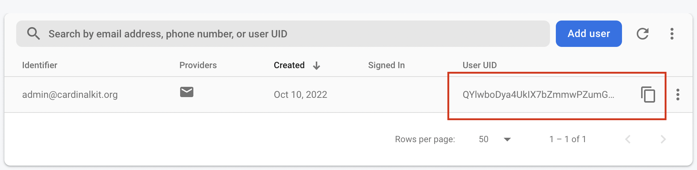

# Admistrative Access

## 1. Create admin account

  

 To manage your dashboard you need to create an Administrator account. This is created from the Firebase console.

 From the [Firebase console](https://console.firebase.google.com), enter the **Authentication** section.

  

 

  
  

 And then add a new user.
 
  

 

  
  

Enter a username and password for the Administrator user.

 

 
 

Now you need to indicate to the web page that this new user is an administrator user, the user roles are managed from the database in firestore
For users created from the web, this process will be automatic, it is necessary to do it by hand only once for the administrator user.

First copy the uid of the user you just created:

 

 
 

Then click on firestore database:

 

 
 

This is the database of the entire project, here you can see all the records of studies and users generated in the application.

Create a new collection called user_roles, add a document with the uid of the previously created user

Finally add a field to the role document: "superAdmin".

 

 
 

Now you can log in with your administrator account!

</Block>