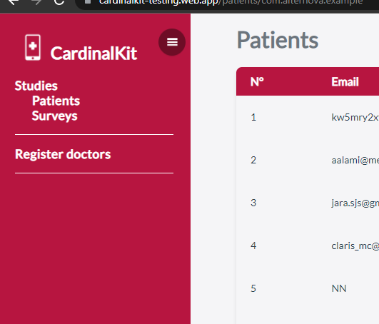
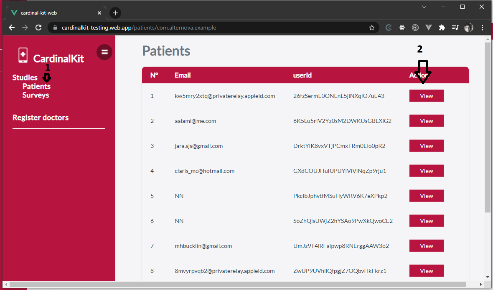
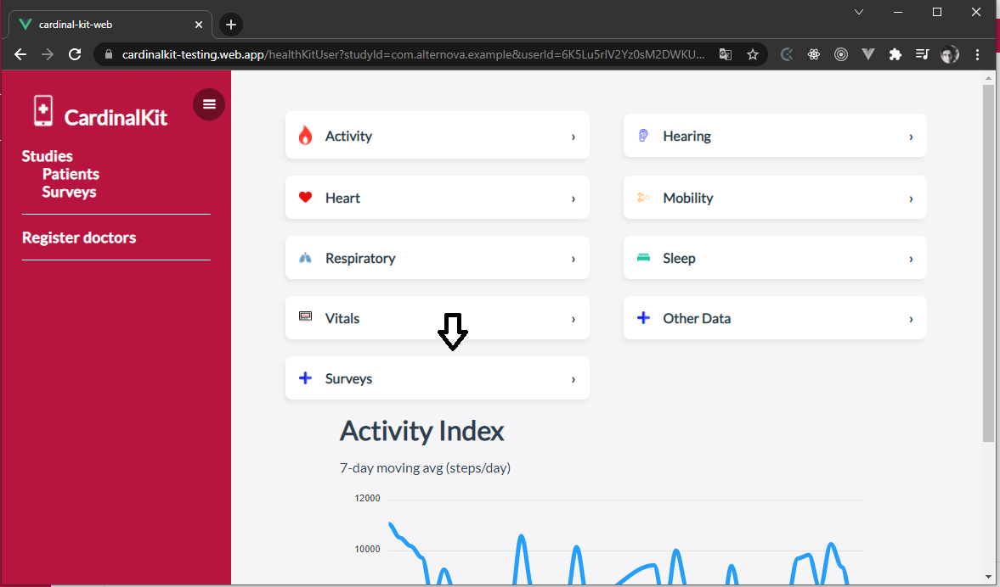
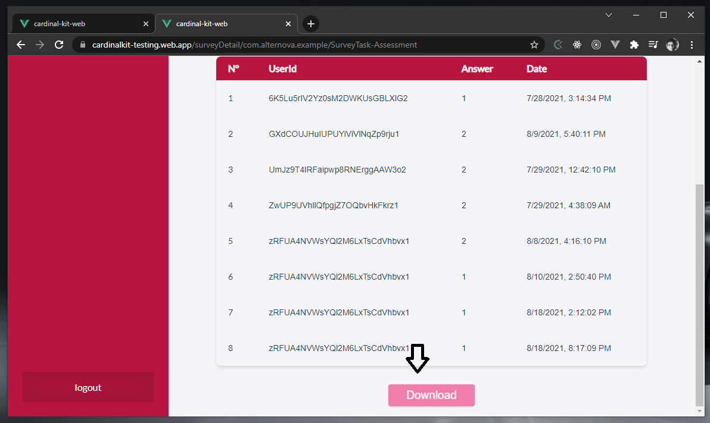

# Survey Creation

CardinalKit allows you to create custom surveys that users can complete on their mobile apps. These surveys can be listed on the *Tasks* screen on the mobile app, or you can schedule them to be completed on specific days or within a certain period. Surveys can also be assigned to a specific user or a study.

::: tip
In order for surveys created via the dashboard to appear in the mobile app, *Use Cloud Surveys* should be set to true in *CKConfiguration.plist*.
:::

## 1. Create a Survey

Log into the dashboard as an administrator, then in the sidebar click on *Surveys*.

Here you will see the list of all the surveys that have been previously created. You can see details, edit, and delete. At the bottom click on *Create new survey*.

On the main screen of your application, the surveys are separated by sections indicating the title, subtitle and the name of the section where it will be located. 
The order number indicates from top to bottom in which position you want it to appear.
Show on main screen whether or not you want it to appear on the main screen of the application.

Surveys are made up of several steps, these can be forms (one step with several questions on a single screen) or individual questions, each one displayed on a different screen.

### - Adding Questions To Your Survey

To add a question, click on *Add Question* and select the type of question you want to add.

### - Creating a Multi-Question Form

You can embed multiple questions into a single form. To create a form, click on *Add question* and in the dropdown list (Select the type of question) choose the *form* option.

Enter a title, unique identifier, and description for the form. The identifier will be used to distinguish this form in the database.

You can multiple questions to the form by clicking on the *Add Form Question* button, then selecting the type of question you wish to add, and repeating until you have added all the questions you need.

## 2. Survey Types

 

#### Text: 
Create an open question with a single line text answer

#### Text Area: 
Create an open question with a text type answer with several lines to answer

#### Single Choice: 
Create a multiple choice question with a single answer

#### Multiple Choice: 
Create a multiple choice question with a choice of 1 or more

#### Form:
Create a form with several questions on a single page

#### Scale: 
Create a question with a numerical answer and a graphic scroll

#### Boolean: 
Create a question with a yes or no answer

#### Instruction: 
Create an instructions page can be displayed at the beginning of the entire questionnaire

#### Signature: 
Create a screen to collect a user's signature

#### Date: 
Create a question with a dated answer

#### Numeric: 
Create a question with a numerical answer in a text box

#### E-mail: 
Create a field for email input

#### Location: 
Collect an address or location of the user

#### Text scale: 
Create a scale question with text values

#### TimeInterval: 
Create a question to answer with a time interval

#### Height: 
Obtain the user's height

#### Weight: 
Obtain the user's weight

#### Socioeconomic: 
Create a scale of socioeconomic levels for the user to choose from

#### Continuous Scale: 
Create a numerical scale including decimal numbers

#### Picker: 
Create a select with multiple options

#### Summary: 
Show the user a final message

## 3. Scheduling Surveys

The survey you created in the previous portion of the guide can also be scheduled to appear on the calendar of the mobile app on specific days.

To add a questionnaire to the schedule, on the survey page, click on the *Scheduler* button.

 
 

There you will see a calendar and a table with the currently scheduled surveys. To schedule a new one, click on the *Add Survey to Calendar* button.

 
 

A pop up will appear where you can select the survey you wish to schedule, as well as indicate the start and end date of your survey, as well as the interval of days in between each day the survey will be offered to the user. You can also add a description that will appear on the mobile app calendar.

 
 

## 4. Assigning a Survey to a Specific User

It is also possible to assign surveys to specific users.

To do this, go to the *Patients* screen and select the patient you want to assign the survey to by clicking the *View* button next to their user ID.

 
 

Now click the *Surveys* button.

 
 

Now you should be able to see all the surveys this user has taken, as well as schedule a new survey for them to take by clicking the *Scheduler* button.

 
 

Now you can select a survey and enter in the start and end dates as well as a description.

 ## 5. Download Answers

CardinalKit features the ability to download all the responses of all users to a specific survey in a single comma-separated value (CSV) file.
 
 
To download results as a CSV file, go to the surveys tab and select the *Details* button for a specific survey.

 
 

You will see the results for each question in a table. You can download all the results as a CSV file by clicking the *Download* button at the bottom of the table.

  

 
 

If you open the CSV file in a spreadsheet editor, you will see the details of each question and each user's response as shown below.

  