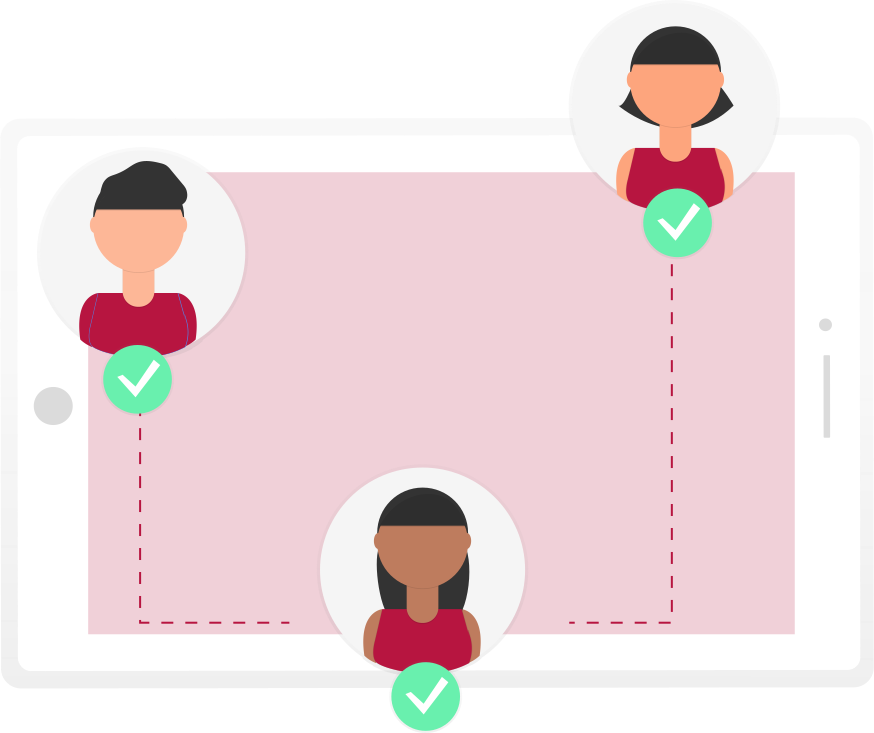
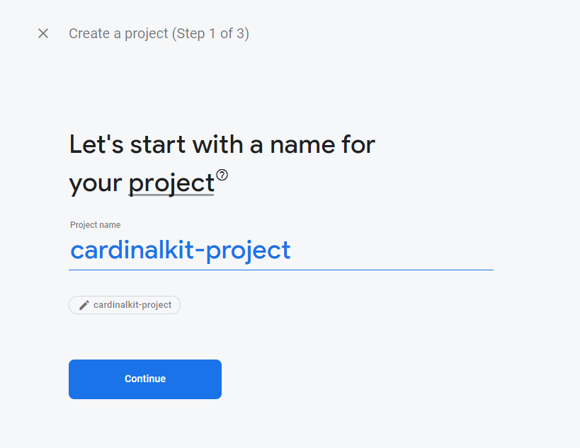
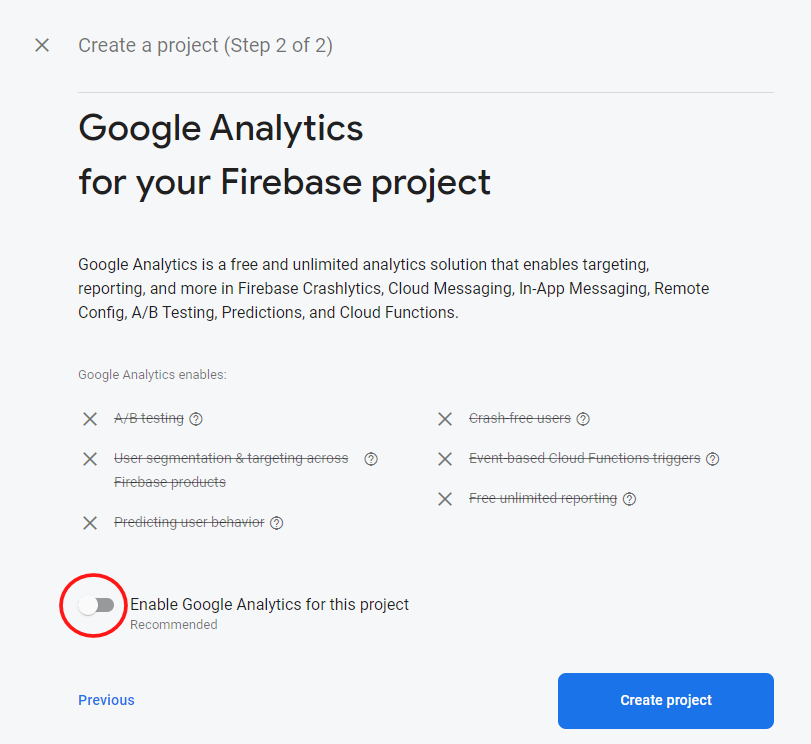
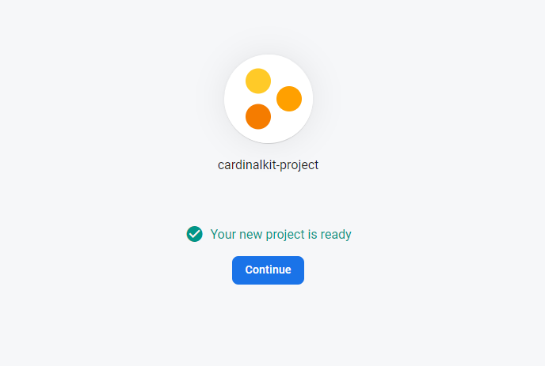
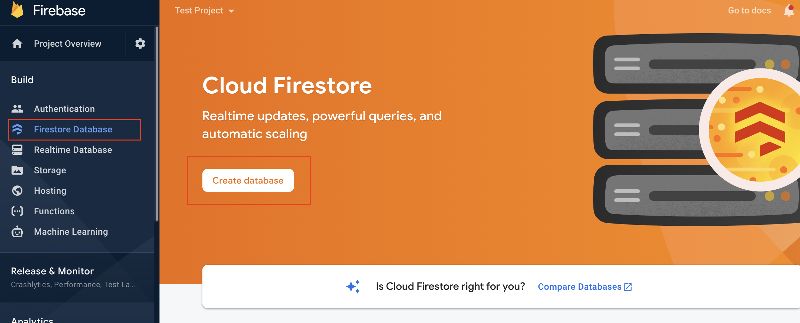
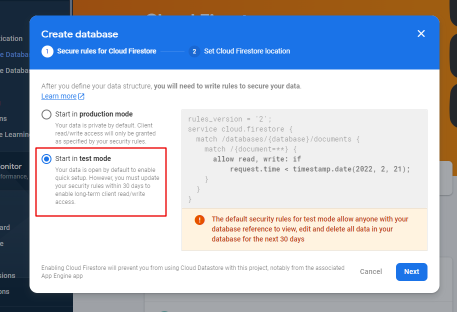
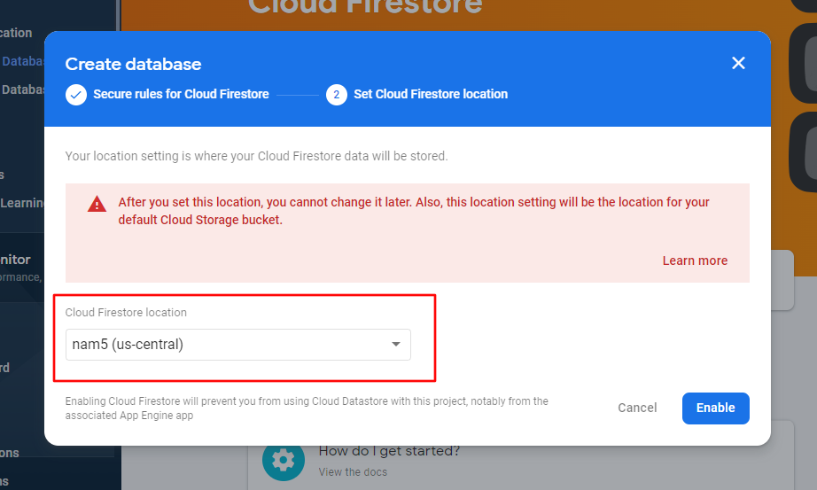
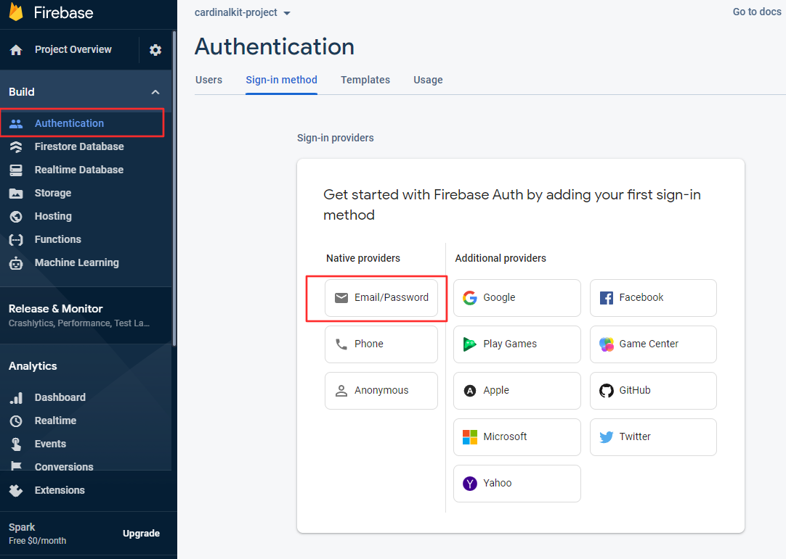
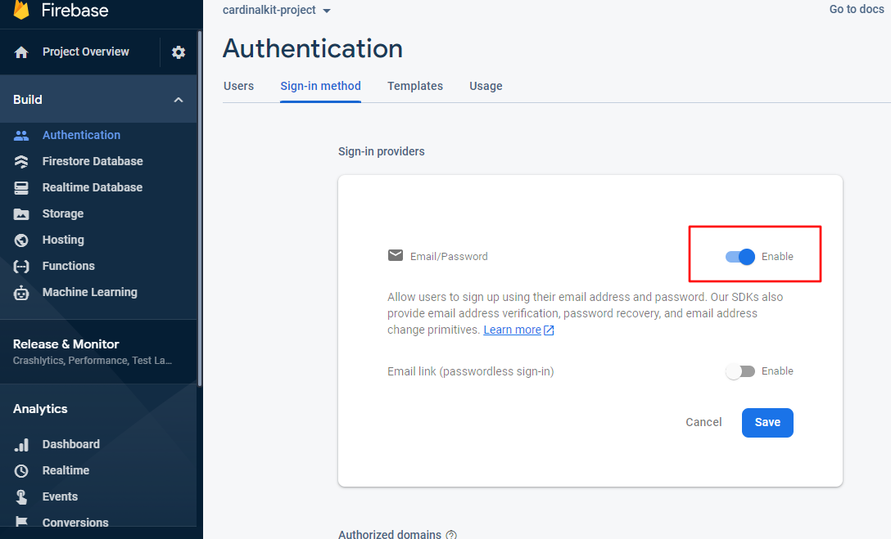

# Set Up Backend Infrastructure

 

Prior to CardinalKit, researchers would need to implement a backend solution of their choosing so data that their subjects were gathering could be securely stored. CardinalKit leverages existing database architecture on the Google Cloud platform to make it as frictionless as possible to get started with collecting information on your users.

 

::: tip
If you already have set up a Firebase account for your CardinalKit iOS application, you can use the same account for your Android application, simply skip to Step 2.
:::

## 1. Create a Firebase Account

Head on over to <a href="https://firebase.google.com">firebase.google.com</a> and set up an account.
Note: you may need to use your personal email instead of your university assigned one.

Once, your account is created, log into your Firebase console (top right) and add a new project. Name the project to be something related to your app for future reference.

 
 

It is important that you disable Google Analytics because it is not HIPAA compliant and then click "Create". It will take around a minute to set up.

 

 
 

When your project is ready, click "Continue". 

 

Now you will be returned to the console. Click "Firestore Database" under the "Build" section in the sidebar, and then "Create database".
 
 

 
 

Be sure to start the database in test mode so your research IT can configure the rules for the storage.

 

::: tip
When developing and testing your application, it is fine to use your own custom Firebase backend. However, in production, it is easier to hand-off database maintenance to your IT department (e.g. Stanford Medicine IT). Their configuration will be guaranteed to be HIPAA compliant.
:::

 
 

Finally, set the deploy location to "us-central" or any location close to your study and click "Enable".

 

## 2. Link App to Firebase Project

The last step is to configure your CardinalKit app to communicate with your newly created Firebase database. In the sidebar, select "Project Overview" and then select the "Android" icon in the main pane to add a new Android app to your project.

Fill in your Android package name, an optional nickname for your app, and then click "Register App"

Now download the "google-services.json" file. Open up Android Studio and switch to "Project" view to see your project's root directory. Replace the "google-services.json" file with the file you have just downloaded.

## 3. Setting up Email/Password Authentication

In your Firebase console, click on "Authentication", then click on "Email/Password". 

::: tip
If you have already set up an authentication method and are adding another one, you will see a different screen at this step. In that case, click on "Sign-In Method" at the top and click "Add New Provider", instead.
:::

 

On the next screen, enable "Email/Password Sign On" and click "Save".

 

You should now see that Email/Password authentication has been enabled.
